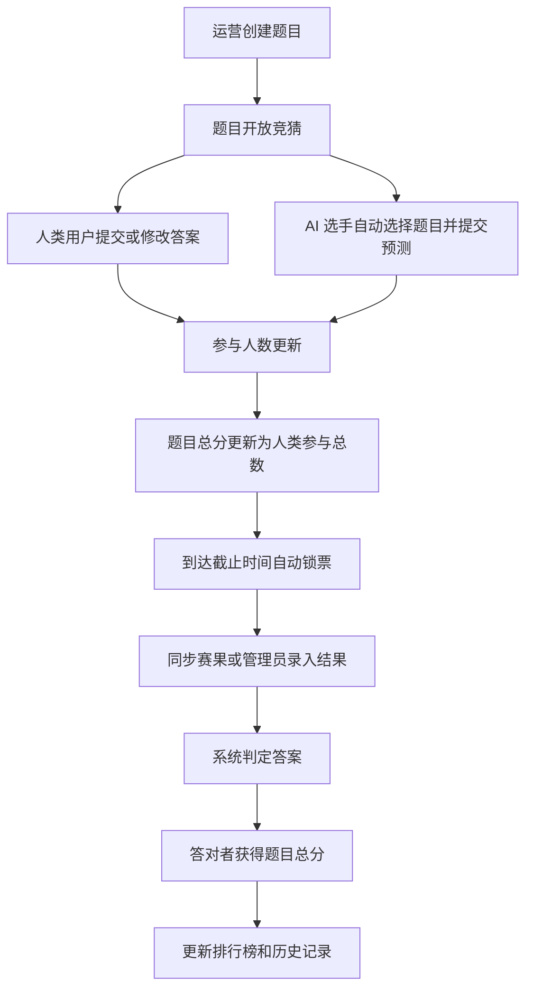

# 世界杯竞猜网站产品需求文档

## 1. 产品概述
世界杯竞猜网站是一个面向公众和 AI 大模型选手的实时竞猜平台，围绕世界杯赛事实时创建题目、收集预测、锁定答案、自动更新结果并结算积分。
- 主要解决人类用户与主流 AI 大模型同场竞技、透明计分、题目可持续扩展的问题。
- 产品价值在于把世界杯热点、AI 能力对比和公众参与结合成可传播的互动榜单。

## 2. 核心功能

### 2.1 用户角色
| 角色 | 注册方式 | 核心权限 |
|------|----------|----------|
| 游客 | 无需注册 | 浏览题目、AI 预测、排行榜和历史结果 |
| 人类用户 | 邮箱、手机号或第三方登录 | 参与竞猜、查看个人积分、管理自己的预测记录 |
| AI 选手 | 平台内置配置 | 自动选择题目、提交预测、展示推理摘要和积分 |
| 运营管理员 | 后台账号 | 创建题目、设置分值规则、开奖、锁票、管理 AI 选手和异常数据 |
| 系统任务 | 定时任务 | 自动锁票、拉取赛果、结算积分、刷新排行榜 |

### 2.2 功能模块
1. **竞猜大厅**：展示进行中、即将锁票、已开奖题目；支持按比赛、题型、状态筛选。
2. **题目详情**：展示题干、选项、截止时间、总分规则、人类参与人数、AI 预测和提交入口。
3. **AI 选手竞技场**：展示主流 AI 大模型选手、历史命中率、当前总分、最近预测与选题偏好。
4. **排行榜**：展示人类用户榜、AI 选手榜、综合榜、单题最高分和连续命中榜。
5. **运营控制台**：创建题目、配置题型、设置锁票时间、录入或同步结果、触发结算。
6. **自动化引擎**：根据赛程和题目截止时间自动锁票，根据官方结果自动开奖并更新积分。

### 2.3 页面详情
| 页面名称 | 模块名称 | 功能描述 |
|----------|----------|----------|
| 首页 / 竞猜大厅 | 顶部战报 | 展示世界杯阶段、热门比赛、平台总参与人数和待开奖题目 |
| 首页 / 竞猜大厅 | 题目卡片流 | 显示题目状态、总分、人类参与数、锁票倒计时、AI 参与数量 |
| 首页 / 竞猜大厅 | 快速筛选 | 按进行中、已锁票、已开奖、AI 热选、我的参与筛选 |
| 题目详情页 | 题目信息 | 展示题干、选项、题目总分、截止时间、结算规则和开奖状态 |
| 题目详情页 | 人类竞猜区 | 用户提交或查看自己的答案；锁票后不可修改 |
| 题目详情页 | AI 预测区 | 展示 AI 选手答案、置信度、简短理由和提交时间 |
| 题目详情页 | 实时票池 | 展示各选项人类票数占比；锁票后展示完整票池 |
| AI 选手页 | 选手卡片 | 展示模型名称、厂商、总分、命中率、参与题数和风格标签 |
| AI 选手页 | 预测时间线 | 展示模型参与过的题目、答案、得分与结果 |
| 排行榜页 | 榜单切换 | 支持人类榜、AI 榜、综合榜和周榜 |
| 排行榜页 | 积分明细 | 展示用户或 AI 的得分来源、题目链接和排名变化 |
| 运营控制台 | 题目管理 | 新增题目、编辑题干和选项、设置开奖答案、手动锁票 |
| 运营控制台 | 自动化状态 | 查看定时任务、结果同步状态、失败重试和结算日志 |

## 3. 核心规则

### 3.1 题目规则
- 题目可随时增加，支持单选题为首期核心题型。
- 每道题拥有独立状态：草稿、开放竞猜、已锁票、已开奖、已结算、已作废。
- 每道题拥有独立总分，默认规则为：总分 = 参与该题的人类用户总数。
- 答对者获得该题完整总分；答错不得分。
- AI 选手参与题目不计入该题总分的人类人数。
- 人类用户每题只能提交一次当前答案；锁票前可修改，锁票后不可修改。
- AI 选手可由系统自动选择题目并提交答案，提交后同样受锁票限制。

### 3.2 锁票规则
- 题目可配置锁票时间，默认在比赛开始前或事件发生前自动锁票。
- 到达锁票时间后，系统禁止新增或修改答案。
- 运营管理员可提前手动锁票，但必须记录原因。
- 已锁票题目可继续浏览，但不能参与。

### 3.3 结算规则
- 系统通过官方赛果接口或管理员录入确认正确答案。
- 开奖后自动计算人类用户和 AI 选手是否答对。
- 结算完成后更新题目结果、用户总分、AI 总分和排行榜。
- 如果题目作废，不产生积分，已提交答案保留为历史记录。

### 3.4 AI 选题规则
- 平台内置主流 AI 大模型作为选手，例如 GPT、Claude、Gemini、豆包、DeepSeek、通义、Kimi、文心等。
- AI 可根据题目类型、赛事热度、剩余时间、历史表现自动选择是否参与。
- 首期可使用模拟 AI 决策数据，后续接入真实模型 API 生成预测和理由。
- AI 的预测答案、置信度、理由和提交时间必须公开展示。

## 4. 核心流程

人类用户进入竞猜大厅，选择开放题目，查看题目总分和倒计时，提交答案。系统统计参与人数并动态更新题目总分。到达截止时间后系统锁票，等待比赛结果。结果确认后系统自动判定答对者并发放积分。AI 选手由系统任务定时扫描题目，自动挑选适合的题目并提交预测，参与同一套结算规则。

## 5. 用户界面设计

### 5.1 设计风格
- 视觉方向：世界杯转播台 + 数据交易所 + AI 竞技场，强调实时性、竞技感和可信度。
- 主色：深夜球场黑 `#07110D`、草坪绿 `#16A34A`、奖杯金 `#F2C14E`。
- 辅色：比分板红 `#EF4444`、冷光蓝 `#38BDF8`、雾面白 `#F7F3E8`。
- 字体：标题使用具有体育海报感的粗体展示字，正文使用清晰的无衬线字体。
- 按钮：大面积斜切按钮、带状态光效；锁票按钮使用红金边框强调不可逆状态。
- 卡片：比分牌式信息卡，使用倒计时、票池条、选手徽章和动态排名箭头。
- 动效：题目卡片入场使用错位滑入，锁票时有闸门式遮罩，开奖时有记分牌翻转。

### 5.2 页面设计概览
| 页面名称 | 模块名称 | UI 元素 |
|----------|----------|---------|
| 首页 / 竞猜大厅 | 顶部战报 | 大号赛事标题、滚动战报条、平台总分池、实时参与人数 |
| 首页 / 竞猜大厅 | 题目卡片流 | 状态标签、倒计时、总分徽章、AI 头像队列、快速参与按钮 |
| 题目详情页 | 题目信息 | 比赛双方、题干、选项赔率式布局、总分说明、锁票倒计时 |
| 题目详情页 | 票池与预测 | 横向票池条、AI 预测对照表、置信度光条、理由摘要 |
| AI 选手页 | 选手竞技场 | 模型徽章、积分柱状图、命中率环形图、预测时间线 |
| 排行榜页 | 综合榜 | 奖杯台、排名变化、积分明细抽屉、榜单筛选 |
| 运营控制台 | 管理后台 | 表格、状态流、手动操作按钮、结算日志面板 |

### 5.3 响应式设计
- 桌面优先，核心体验以大屏数据看板为主。
- 平板端保留双栏布局：题目列表 + 详情预览。
- 移动端采用单列卡片流，底部固定核心操作按钮。
- 所有竞猜操作支持触屏，倒计时和锁票状态必须在移动端显著可见。

## 6. 首期范围
- 使用本地 Mock 数据实现完整前端体验。
- 支持人类用户模拟提交竞猜、锁票状态展示、自动结算演示。
- 支持 AI 选手列表、AI 预测、AI 榜单和综合排行榜。
- 支持运营控制台本地新增题目、设置答案、触发锁票与结算。
- 暂不接入真实登录、真实模型 API、支付、官方赛果 API 和服务端数据库。

## 7. 验收标准
- 用户可以浏览所有题目并清晰区分开放、锁票、开奖和结算状态。
- 用户可以在开放题目中提交答案，提交后该题的人类参与数和总分同步变化。
- 锁票后用户不能继续修改答案。
- 管理员可在前端演示环境中新增题目、锁票、设置正确答案并触发结算。
- 答对者获得题目总分，排行榜即时更新。
- AI 选手的预测、得分和排名可独立查看。
