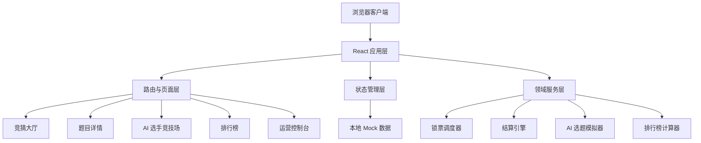
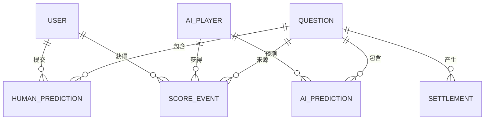
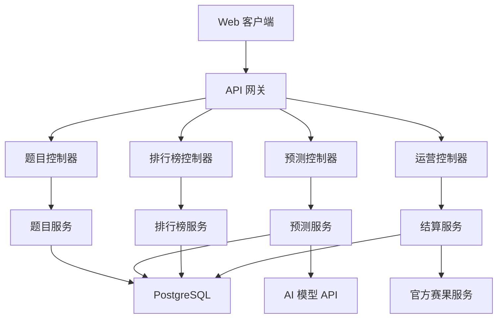

# 世界杯竞猜网站技术架构文档

## 1. 架构设计



首期实现为纯前端可运行演示应用，使用本地数据和前端状态完成完整业务闭环。后续可平滑替换为服务端 API、数据库、真实 AI 模型 API 和官方赛果接口。

## 2. 技术描述
- 前端：React@18 + TypeScript + Vite
- 样式：Tailwind CSS@3 + CSS 变量 + 少量自定义动画
- 路由：React Router
- 状态管理：React Context + useReducer
- 图表与可视化：自定义 SVG / CSS 进度条，避免首期引入重型图表库
- 数据：本地 Mock 数据，浏览器运行时内存状态
- 后端：首期无后端
- 数据库：首期无数据库，后续建议 PostgreSQL
- 初始化工具：Vite

## 3. 路由定义
| 路由 | 用途 |
|------|------|
| `/` | 竞猜大厅，展示题目列表、平台概览和快速筛选 |
| `/questions/:questionId` | 题目详情，提交竞猜、查看票池、AI 预测和结算结果 |
| `/ai-players` | AI 选手竞技场，展示模型表现、预测历史和排名 |
| `/leaderboard` | 排行榜，展示人类榜、AI 榜和综合榜 |
| `/admin` | 运营控制台，新增题目、锁票、开奖和触发结算 |

## 4. 前端模块设计
| 模块 | 责任 |
|------|------|
| `App` | 应用入口、路由、全局布局 |
| `DataProvider` | 管理题目、用户、AI 选手、预测、提交记录和结算结果 |
| `questionService` | 创建题目、更新题目状态、计算题目总分 |
| `predictionService` | 处理人类提交、AI 提交和答案修改限制 |
| `settlementService` | 根据正确答案计算得分并更新排行榜 |
| `automationService` | 模拟自动锁票、自动开奖和 AI 选题 |
| `leaderboardService` | 计算人类榜、AI 榜、综合榜和排名变化 |
| `components` | 复用卡片、按钮、状态标签、倒计时、票池条和榜单行 |

## 5. 数据模型

### 5.1 数据模型定义


### 5.2 TypeScript 类型
```typescript
export type QuestionStatus =
  | 'draft'
  | 'open'
  | 'locked'
  | 'revealed'
  | 'settled'
  | 'voided';

export interface QuestionOption {
  id: string;
  label: string;
  description?: string;
}

export interface Question {
  id: string;
  title: string;
  matchLabel: string;
  category: 'match_result' | 'score' | 'player' | 'event' | 'custom';
  status: QuestionStatus;
  options: QuestionOption[];
  lockAt: string;
  createdAt: string;
  correctOptionId?: string;
  humanParticipantCount: number;
  totalScore: number;
}

export interface HumanUser {
  id: string;
  name: string;
  avatarColor: string;
  totalScore: number;
}

export interface AiPlayer {
  id: string;
  name: string;
  provider: string;
  badge: string;
  styleTags: string[];
  totalScore: number;
  hitRate: number;
  participatedCount: number;
}

export interface Prediction {
  id: string;
  questionId: string;
  participantType: 'human' | 'ai';
  participantId: string;
  optionId: string;
  confidence?: number;
  reasoning?: string;
  submittedAt: string;
  isCorrect?: boolean;
  earnedScore?: number;
}

export interface ScoreEvent {
  id: string;
  questionId: string;
  participantType: 'human' | 'ai';
  participantId: string;
  score: number;
  reason: string;
  createdAt: string;
}
```

## 6. 核心业务算法

### 6.1 题目总分
```typescript
totalScore = humanParticipantCount;
```

说明：
- 只统计人类用户的唯一参与人数。
- AI 选手参与不增加总分。
- 同一人类用户修改答案不重复增加参与人数。

### 6.2 锁票判断
```typescript
canSubmit = question.status === 'open' && Date.now() < new Date(question.lockAt).getTime();
```

说明：
- 自动任务会把过期开放题切换为 `locked`。
- UI 层同时做倒计时和禁用按钮，领域服务层做最终校验。

### 6.3 结算积分
```typescript
earnedScore = prediction.optionId === question.correctOptionId ? question.totalScore : 0;
```

说明：
- 人类和 AI 使用同一判定规则。
- 已结算题目不可重复结算。
- 作废题目不发放积分。

### 6.4 AI 自动选题
```typescript
score = topicHeat * 0.4 + timeUrgency * 0.25 + modelPreference * 0.25 + randomness * 0.1;
```

说明：
- 首期用本地模拟器生成 AI 参与行为。
- 后续可把 `modelPreference` 替换为真实模型 API 返回的选择理由。

## 7. API 定义
首期无真实后端 API。为后续扩展预留以下接口契约：

```typescript
interface CreateQuestionRequest {
  title: string;
  matchLabel: string;
  category: Question['category'];
  options: QuestionOption[];
  lockAt: string;
}

interface SubmitPredictionRequest {
  questionId: string;
  participantType: 'human' | 'ai';
  participantId: string;
  optionId: string;
  confidence?: number;
  reasoning?: string;
}

interface RevealQuestionRequest {
  questionId: string;
  correctOptionId: string;
}

interface SettlementResult {
  questionId: string;
  totalScore: number;
  winners: Array<{
    participantType: 'human' | 'ai';
    participantId: string;
    earnedScore: number;
  }>;
}
```

## 8. 后续服务端架构



## 9. 安全与一致性
- 锁票必须由服务端时间判定，首期前端只做演示。
- 真实上线时，提交预测接口需要幂等键，避免重复提交。
- 结算任务必须可重试且不可重复发分。
- 管理员操作必须记录审计日志，尤其是提前锁票、修改答案和作废题目。
- 排行榜应由结算事件累加生成，避免直接修改总分导致追溯困难。

## 10. 首期实现计划
- 初始化 Vite React TypeScript 项目和 Tailwind。
- 构建本地 Mock 数据：题目、AI 选手、人类用户、预测记录。
- 实现竞猜大厅、题目详情、AI 选手页、排行榜和运营控制台。
- 实现本地状态管理、提交答案、锁票、开奖、结算和榜单刷新。
- 添加关键交互动效：题目卡片、锁票遮罩、开奖翻牌、排行榜变化。
