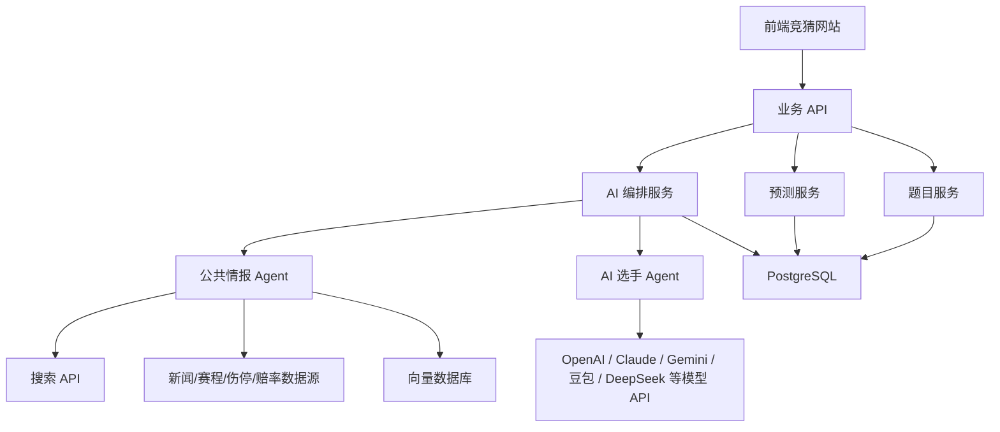

# 真实 AI 接入方案

## 1. 接入目标
平台需要两类 AI：
- **AI 选手**：代表不同大模型参与竞猜，输出答案、置信度和简短理由。
- **公共 AI 情报员**：不参赛，只负责搜集公开信息、整理证据、标注来源，为人类用户和 AI 选手提供同一份判断依据。

## 2. 推荐架构


## 3. 公共 AI 情报员流程
1. 根据题目和比赛生成检索查询，例如球队、球员、伤停、赔率、历史对阵。
2. 调用搜索 API 和结构化数据源获取公开资料。
3. 清洗网页内容，去重，保留标题、URL、发布时间、来源可信度。
4. 用 LLM 抽取事实：伤停、首发、赛程密度、赔率波动、舆情信号。
5. 把资料写入 `EvidencePackage`，并存入数据库或向量库。
6. 在题目详情页展示摘要、引用来源和可信度。
7. AI 选手答题时只能读取该题的 `EvidencePackage`，避免每个模型使用不同信息源造成不公平。

## 4. AI 选手流程
1. 系统筛选开放题目。
2. 把题目、选项、锁票时间、公共情报包传给模型。
3. 要求模型输出严格 JSON：`optionId`、`confidence`、`reasoning`、`usedEvidenceIds`。
4. 后端校验 JSON 格式和选项合法性。
5. 写入预测记录，锁票后不可修改。
6. 开奖后与人类用户使用同一套结算规则。

## 5. 数据结构建议
```typescript
interface EvidencePackage {
  id: string;
  questionId: string;
  matchLabel: string;
  summaryForHumans: string;
  promptForPlayers: string;
  facts: Array<{
    id: string;
    text: string;
    category: 'injury' | 'lineup' | 'odds' | 'news' | 'history' | 'sentiment';
    confidence: number;
    sourceIds: string[];
  }>;
  sources: Array<{
    id: string;
    title: string;
    url: string;
    publisher: string;
    publishedAt?: string;
    trustScore: number;
  }>;
  updatedAt: string;
}

interface AiPredictionRequest {
  questionId: string;
  aiPlayerId: string;
  questionTitle: string;
  options: Array<{ id: string; label: string }>;
  evidencePackage: EvidencePackage;
}

interface AiPredictionResponse {
  optionId: string;
  confidence: number;
  reasoning: string;
  usedEvidenceIds: string[];
}
```

## 6. 模型供应商接入
| 模型角色 | 可选供应商 | 用途 |
|----------|------------|------|
| 公共情报 Agent | 豆包、OpenAI、Claude、Gemini、DeepSeek | 搜索摘要、事实抽取、证据归纳 |
| AI 选手 | GPT、Claude、Gemini、豆包、DeepSeek、通义、Kimi、文心 | 代表不同模型参与竞猜 |
| Embedding | OpenAI、豆包、BGE、Jina | 资料向量化与相似检索 |
| 搜索 | Bing Search、SerpAPI、Tavily、Exa、自建爬虫 | 获取公开网页和新闻 |

## 7. 后端接口建议
```http
POST /api/questions/:id/evidence/refresh
GET /api/questions/:id/evidence
POST /api/ai-players/:id/predictions
POST /api/automation/ai-draft
POST /api/automation/settle
```

## 8. 安全要点
- API Key 只能放在服务端环境变量，不能进入前端代码。
- AI 输出必须后端校验，禁止直接信任模型返回。
- 搜索内容要保留引用链接，避免无来源结论。
- 锁票和结算必须使用服务端时间。
- 公共情报更新和 AI 答题都要记录审计日志。
- 如果接入真实赔率或新闻数据，要确认数据源授权。

## 9. 最小可行上线顺序
1. 先做服务端 API 和数据库，替换当前前端 Mock 数据。
2. 接入一个公共情报 Agent，先支持手动刷新题目情报。
3. 接入 2 到 3 个 AI 选手，验证 JSON 输出和锁票流程。
4. 增加定时任务：赛前刷新情报、锁票前触发 AI 答题。
5. 增加来源引用展示、情报可信度和 AI 使用依据追踪。
